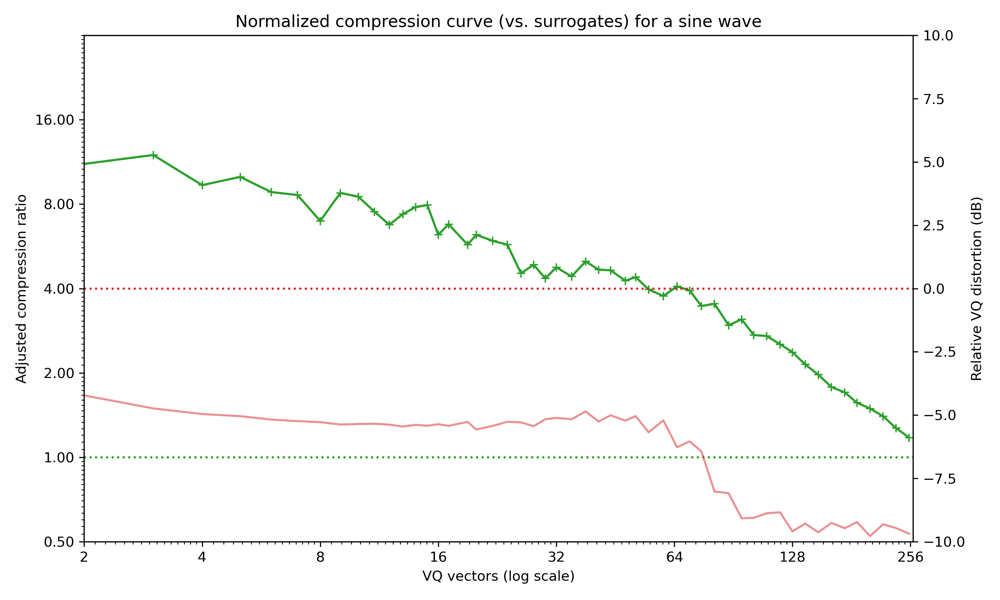
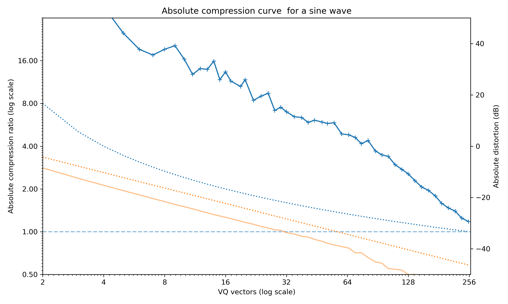
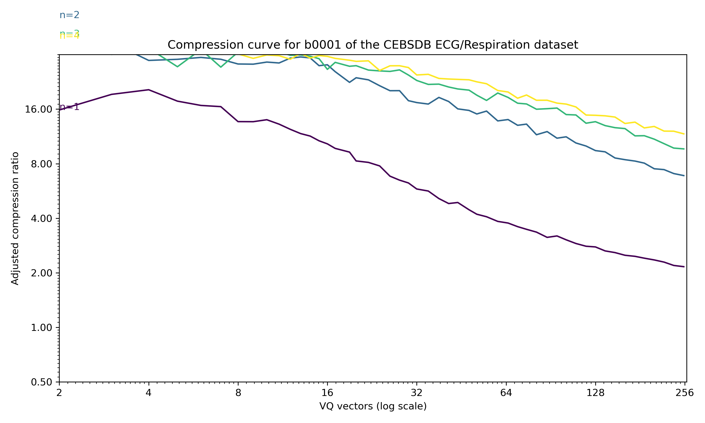

# Compression curves

This repostitory has some simple Python functions for analysing continuous (multivariate) time series in terms of compression. The basic principle is to quantize the continuous data, compress it with a standard algorithm (like LZW), and then measure how much shorter the compressed version is. 


*Normalised compression curve for a recording of a few seconds of human speech (PCM, 11Khz). Green line shows the compression ratio, while the orange shows (excess) quantisation error.*

```python
import scipy.io.wavfile
_, ex7 = scipy.io.wavfile.read("ex7.wav")
fig, ax = plt.subplots(figsize=(10, 6))
# compute the quantisation-compression curve
z_curve, z_surrogate, d_curve = compression_surrogate_curve(ex7[:45000:4], k_r)
# plot it
plot_compression_curve(ax, k_r, z_curve, z_surrogate, d_curve)
```

## Requirements
The code depends on `scikit-learn`, `numpy` and `scipy` only. [faiss](https://github.com/facebookresearch/faiss) will be automatically used if installed to speed up vector quantisation.

## Computing compression curves
Any discretised compression obviously depends on the quantisation used. I use plain old vector quantisation, so quantisation adapts to the data distribution. By quantising at a *range* of levels and plotting a compression curve of *ratio vs. quantisation_levels* the effect of quantisation can be visualised. And by comparing compression ratios to that of time-shuffled *surrogate* discretised sequences the result can be normalised to be less sensitive to quirks of compression algorithms.

Random data is incompressible, so shows a flat curve:


*Compression curve for random normal data -- incompressible data appears as a flat green line.*

The underlying hypothesis is that lossless compression like LZW (weakly) bounds the Kolmogorov complexity of a sequence, an approximation which gets better as sequences get longer. This is a practically useful measure of how "complex" a signal is, although theoretically controversial. Lossless compressors apply to discrete sequences, so a discretisation step is required. I use simple k-means vector quantisation. 

This rather slow for large datasets, as the vector quantisation has to be performed many times, though subsampling can be used to reduce quantisation time at the expense of slightly poorer approximations.

## Plots

The standard plots produced by `plot_compression_curve` show:
- the compression ratio, where 2 means 2:1 compression *relative to the average surrogate compression ratio*, on a log-scale
- the excess mean distortion in decibels, which is the the average error introduced by quantisation *minus* the expected quantisation level for `k` levels (6.02 log2(k) - 1.76 dB)
The plots use a log-scale x-axis with number of clusters `k` ranging from 2 to 256, geometrically spaced.



*Compression curve for a sine wave as produced by `plot_compression_curve`. This signal is obviously very repetitive and compresses extremely well!*

`plot_absolute_compression_curve` removes the surrogate compensation and the expected quantisation level and just plots the raw compression level and quantisation error.



*Absolute compression curve for the sine wave example.*

The rate-distortion curve can be plotted with `plot_rd_curve`, and shows the surrogate-compensated compression ratio against absolute quantisation error:


*Rate-distortion curve for the sine wave.*

## Implementation

The simplest implementation is:

```python
for k in range(2,256):
    vq_bytes = [c.to_bytes() for c in vq(x, k)]
    print(len(vq_bytes) / len (zlib.compress(vq_bytes)))
```

where vector quantisation  produces a bytestream, compresses it and we compute the compression ratio. There's a few details which need dealing with; in particular the data should be preprocessed first (to remove scaling effects) and the absolute compression ratio is more useful with a surrogate baseline.

### Pipeline

```
                             /----------------------------------------------> distortion
                             |
down(q) -> [norm|PCA(n)] -> VQ(k) -> bytes -> compress ---> ratio --------+-> adj. ratio
                                     |                                    |           
                                     \-> shuffle(m) -> compress -> ratio -/
```

- **Down(q)** downsamples the data by applying Gaussian filtering and decimating by a factor of `q` (usually q=1, and no downsampling is applied). 
- **Normalize** standardises the data. Usually this is standard scaling, where the data is transformed to have zero mean and unit std. dev. It can also be fully whitening (i.e. unit *covariance*), or simple min-max scaling.
- **PCA(n)** (optionally) reduces the dimension of the input using principal components analysis to the `n` dimensions with largest variance (this implies full whitening)
- **VQ(k)** applies k-means vector quantization with `k` cluster centres, and transforms the time series into a sequence of integer cluster indices `[c_0, c_1, c_2, ...]` 
    - It also produces the (mean) **distortion**, a measure of how much noise I introduce on average by quantising
- **bytes** the cluster indices are written as a byte stream (typically k<256, so one byte per cluster index).
- **compress** uses a standard compressor (either `zlib` or `lzma`) to compress the cluster index sequence. Headers/checksums etc. are excluded, so the output is a raw bytestream. 
- **ratio** the ratio `len(compress(bytes))/len(bytes)` is computed
- **shuffle(m)** randomly shuffles the byte stream and recompresses. This is repeated `m` times to produce `m` surrogates.
- **adj. ratio** The final output is the ratio of the original compression ratio to that of the (average) surrogate compression ratio.

### Multi-resolution
The basic approach sweeps `k`, the quantisation levels, and plots the compression curves. It is also possible to sweep:

- `n`, the PCA dimensions, to see how different input dimensions affect the compression. 
- `q`, the downsampling factor, creating a Gaussian pyramid with different effective timescales. 

#### Simple power-of-2 Gaussian pyramid

A power-2 of two pyramid just lowpass filter a signal, decimates by two, and repeats to give a multi-resolution representation:

```python
from plot_vq import set_relative_compression_curve_axes, simple_compression_curve
fig, ax = plt.subplots(figsize=(10, 6))
viridis = plt.cm.get_cmap('viridis', len(ex7_pyramid))
for i, level in enumerate(ex7_pyramid):    
    if len(level)>256:
        z_curve, z_surrogate, d_curve = compression_surrogate_curve(level, k_r)        
        simple_compression_curve(ax, k_r, z_curve, z_surrogate, c=viridis(i))
        ax.text(2, z_curve[0]/z_surrogate[0], "q=2^%d" % i, color=viridis(i))
set_relative_compression_curve_axes(ax)
```

This produces one curve per pyramid level:


*The speech example, with a Gaussian pyramid from decimation of 2^0 to 2^7*


#### PCA

This example shows a 4D timeseries of ECG and breathing data from PhysioNet (see attribution below). The compression curve for a sweep through 1..4 PCA dimensions is shown below.



*ECG and breathing data, first 10000 samples from sample `b001` of the CEBSDB 1.0.0 dataset, with n=1 to n=4 PCA dimensions preserved.*

* Data extract from https://physionet.org/content/cebsdb/1.0.0/
    * García-González, M.A.; Argelagós-Palau, A.; Fernández-Chimeno, M.; Ramos-Castro, J., “A comparison of heartbeat detectors for the seismocardiogram,” Computing in Cardiology Conference (CinC), 2013
    * in the Physionet database Goldberger, A., Amaral, L., Glass, L., Hausdorff, J., Ivanov, P. C., Mark, R., ... & Stanley, H. E. (2000). PhysioBank, PhysioToolkit, and PhysioNet: Components of a new research resource for complex physiologic signals. Circulation [Online]. 101 (23), pp. e215–e220.
